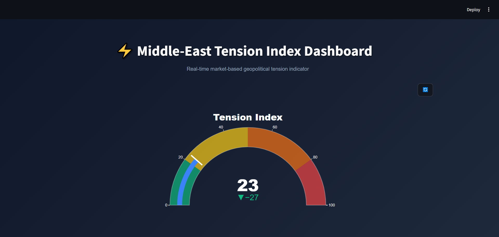
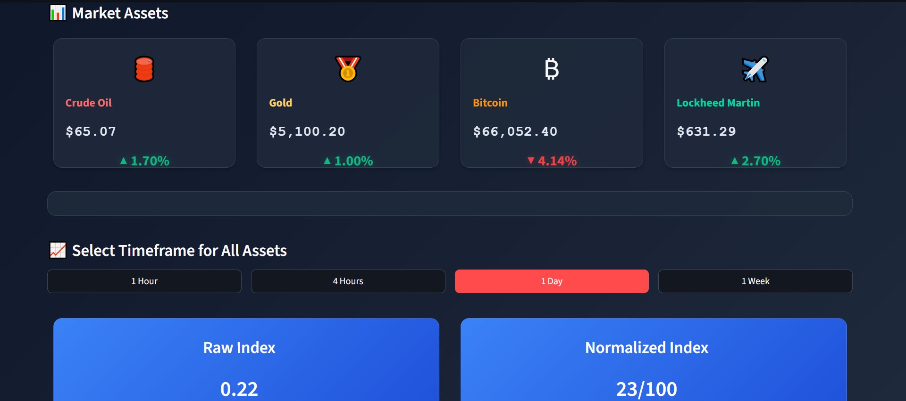

# 🎛️ Middle-East Tension Index

**A self-driven, real-time dashboard tracking geopolitical tension signals in the Middle-East. Born from personal experience during the June 2025 Iran-Israel conflict.**

[](https://github.com/KiarashShayegani/Middle-East-Tension-Indicator/releases/)
[](LICENSE)
[](https://github.com/KiarashShayegani/Middle-East-Tension-Indicator)

## 📖 Background Story
> *"On June 13th, 2025, at 3:20 AM in Tehran, I was awake, recording a video for a university project. The first distant booms seemed like thunder—a common thought before reality shattered the quiet. Within moments, it was undeniable: the sound was not the sky, but the start of a war. I was in complete shock, with no warning.
Weeks later, analyzing the financial markets, I discovered a chilling pattern: key assets like Oil, Gold, and Bitcoin had begun their dramatic moves hours before the public news broke. The early-warning signal was there, hidden in plain sight within the data.
This project was built to decode that signal. It aims to give everyone—not just analysts with Bloomberg terminals—access to that same early-warning capability, transforming complex market movements into a clear, understandable indicator of rising tension in the Middle East."*

## 📊 What This Is
- A **public, real-time dashboard** showing Middle-East tension levels (0-100)
- **Early warning system** using market reactions as leading indicators
- **Citizen-driven project** – built by someone who experienced the tension firsthand
- **Educational tool** for understanding geopolitical risk signals

## 📈 How It Works
The index analyzes four financial assets that react to Middle-East tensions:

| Asset | Weight | Why It Matters |
|-------|--------|----------------|
| **Crude Oil (CL=F)** | 38% | Middle-East supply disruptions directly impact global oil prices |
| **Gold (GC=F)** | 28% | Traditional safe-haven asset during geopolitical uncertainty |
| **Bitcoin (BTC-USD)** | 24% | Digital "risk-off" indicator, often sold for liquidity in crises |
| **Lockheed Martin (LMT)** | 10% | Defense stock proxy for anticipated military spending(changable option) |

**Formula:** `Index = Σ(Asset_Weight × Price_Change)` → Normalized to 0-100 scale

## 🖼️ Dashboard UI Preview (v0.2)



## 🗺️ Version Journey
| Version | Status | Focus | Key Features |
|---------|--------|-------|-------------|
| [v0.1](/versions/v0.1) | ✅ Released | Proof of Concept | Basic 4-asset monitoring, simple gauge |
| [v0.2](/versions/v0.2) | ✅ Released | UI Enhancement | Professional dashboard, multi-timeframe analysis |
| [v1.0](/ROADMAP.md#v10---deployment-release) | 🚧 Planned | Public Deployment | Streamlit Cloud hosting, automated reports |
| [v2.0](/ROADMAP.md#v20---advanced-signals) | 📋 Planned | Signal Expansion | Military tracking, social media sentiment, news aggregation |

## 📂 Repository Structure
```
Middle-East-Tension-Index/
├── versions/           # All versioned code (v0.1, v0.2, etc.)
├── docs/               # Documentation & methodology
├── assets/             # Screenshots & diagrams
├── ROADMAP.md          # Future development plans
├── CHANGELOG.md        # Version history
```

## 🤝 Contributing & Feedback
This is a public project. Have ideas for improvement? Found a bug? Want to add new data sources?
- **Open an Issue** for bugs or feature requests
- **Start a Discussion** for ideas and suggestions

## 📄 License
This project is licensed under the MIT License - see the [LICENSE](LICENSE) file for details.
